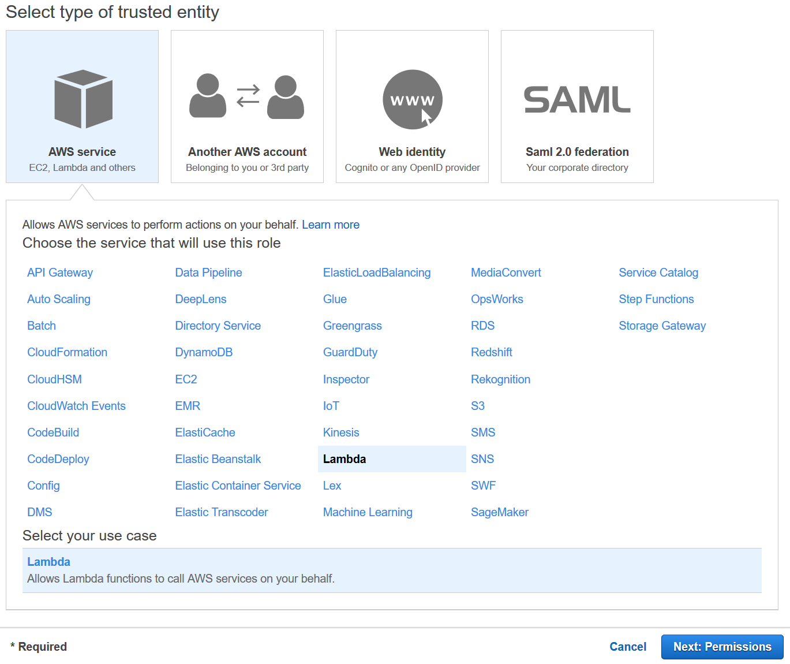
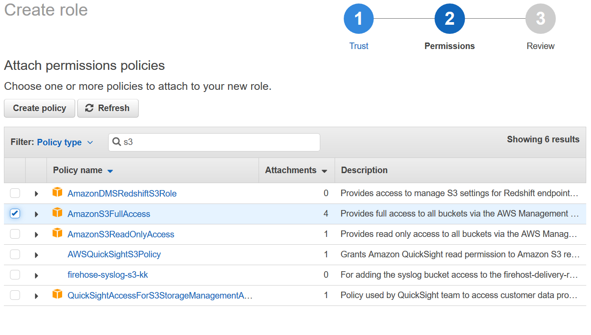

# Lab 3 - Rekognition (including IAM and SES setup)

## Prerequisites
1.	Log into the AWS Console before proceeding with the steps below: https://console.aws.amazon.com
2.	For all steps (except IAM steps), ensure that the "US East (N Virginia)" region is selected in the top, right-hand corner of console screen (see screen-shot below).

## 1. Create IAM Roles

### 1.1 Create IAM Role for Lambda Functions

_We need to create an IAM role to allow our Lambda functions to access AWS services used in this workshop._

1.	To access the IAM Console: In the AWS Console, click on “Services” in the top, left-hand corner of the screen, and click on “IAM” (you can find it by typing _iam_ into the search field at the top of the screen).
2.	On the left-hand side of the screen, click "Roles", and then click “Create Role”.
3.	Click “AWS service” and click “Lambda” (see screenshot below).
4.	Click “Next: Permissions” (at the bottom of the screen).

5.	In the Search field, type _s3_, and then select “AmazonS3FullAccess” (i.e. click the checkbox to the left of “AmazonS3FullAccess”; see screenshot below).

6.	Repeat for other required services as follows…
7.	In the Search field, type _step_, and then select “AWSStepFunctionsFullAccess”.
8.	In the Search field, type _rek_, and then select “AmazonRekognitionFullAccess”.
9.	In the Search field, type _dyn_, and then select “AmazonDynamoDBFullAccess”.
10.	In the Search field, type _ses_, and then select “AmazonSESFullAccess”.
11.	In the Search field, type _cog_, and then select “AmazonCognitoPowerUser”.
12.	Click “Next: Review” (at the bottom of the screen).
13.	In the “Role name” text box, type AI_ML_Lambda_Role
14.	Click “Create role” (at the bottom of the screen).
