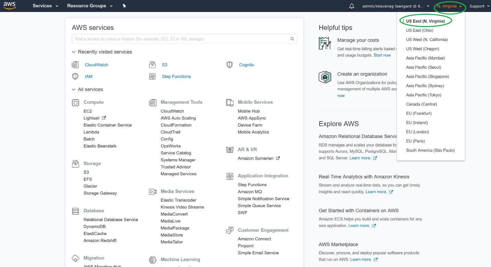

# 3 - Rekognition (including IAM and SES setup)

## Prerequisites
1.	You will need an AWS account in order to perform the steps in this document.
2.	Install the AWS CLI by following the instructions at the following link: https://docs.aws.amazon.com/cli/latest/userguide/installing.html
3.	Configure the AWS CLI by following the instructions at the following link: https://docs.aws.amazon.com/cli/latest/userguide/cli-chap-getting-started.html 
4.	Log into the AWS Console before proceeding with the steps below: https://console.aws.amazon.com
5.	For all steps (except IAM steps), ensure that the "US East (N Virginia)" region is selected in the top, right-hand corner of console screen (see screen-shot below).

6.	Throughout the procedures in this document, you will need to keep track of certain details about each of the AWS resources you are creating.  Open and maintain a text file that will allow you to keep track of these details.
