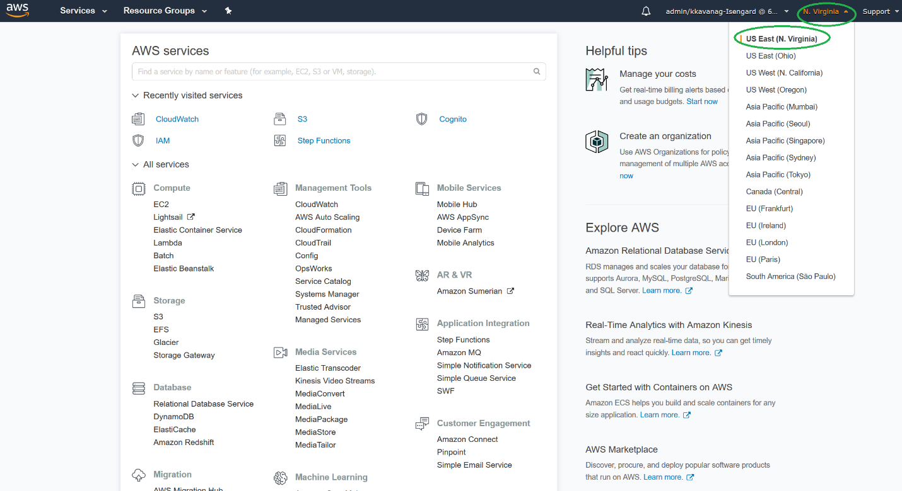
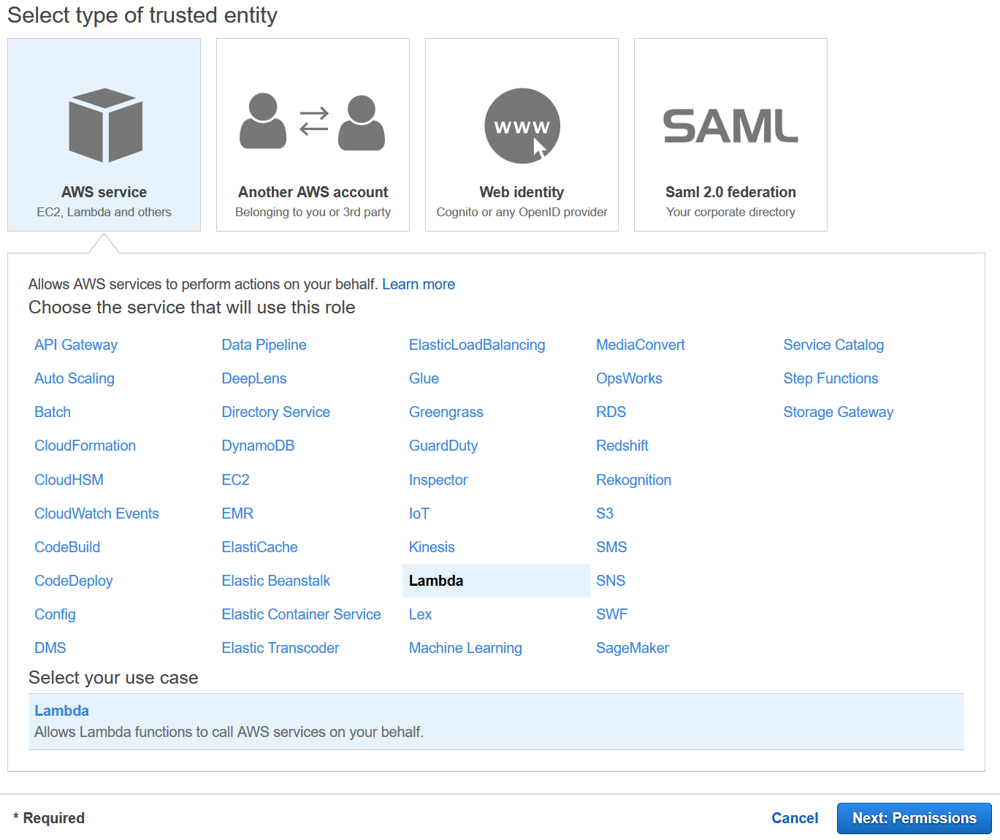
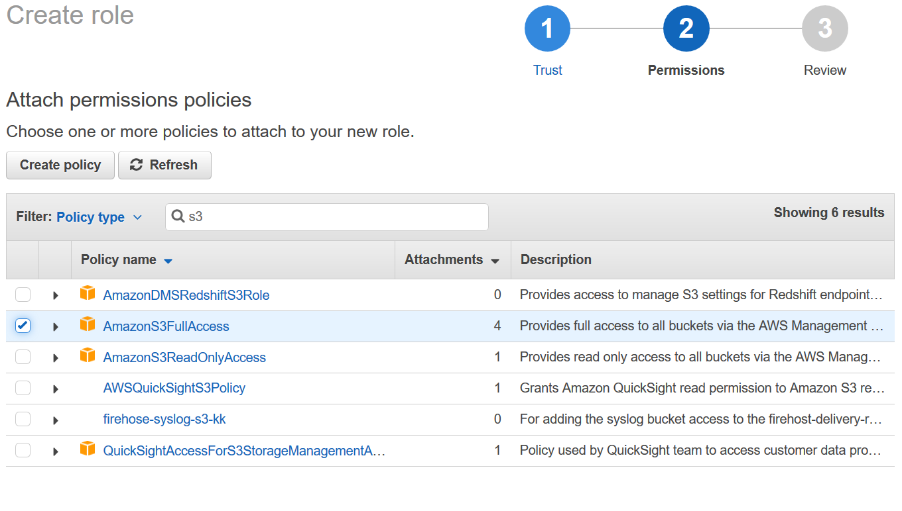

# Lab 3 - Rekognition (including IAM and SES setup)

## Prerequisites
1.	Install the AWS CLI by following the instructions at the following link: https://docs.aws.amazon.com/cli/latest/userguide/installing.html
2.	Configure the AWS CLI by following the instructions at the following link: https://docs.aws.amazon.com/cli/latest/userguide/cli-chap-getting-started.html
3.	Log into the AWS Console before proceeding with the steps below: https://console.aws.amazon.com
4.	For all steps (except IAM steps), ensure that the "US East (N Virginia)" region is selected in the top, right-hand corner of console screen (see screen-shot below).

## 1. Create IAM Roles

### 1.1 Create IAM Role for Lambda Functions

_We need to create an IAM role to allow our Lambda functions to access AWS services used in this workshop._

1.	To access the IAM Console: In the AWS Console, click on “Services” in the top, left-hand corner of the screen, and click on “IAM” (you can find it by typing _iam_ into the search field at the top of the screen).
2.	On the left-hand side of the screen, click "Roles", and then click “Create Role”.
3.	Click “AWS service” and click “Lambda” (see screenshot below).
4.	Click “Next: Permissions” (at the bottom of the screen).

5.	In the Search field, type _s3_, and then select “AmazonS3FullAccess” (i.e. click the checkbox to the left of “AmazonS3FullAccess”; see screenshot below).

6.	Repeat for other required services as follows…
7.	In the Search field, type _step_, and then select “AWSStepFunctionsFullAccess”.
8.	In the Search field, type _rek_, and then select “AmazonRekognitionFullAccess”.
9.	In the Search field, type _dyn_, and then select “AmazonDynamoDBFullAccess”.
10.	In the Search field, type _ses_, and then select “AmazonSESFullAccess”.
11.	In the Search field, type _cog_, and then select “AmazonCognitoPowerUser”.
12.	Click “Next: Review” (at the bottom of the screen).
13.	In the “Role name” text box, type AI_ML_Lambda_Role
14.	Click “Create role” (at the bottom of the screen).

### 1.2 Create IAM Role for API Gateway to Step Functions

_As seen in the architecture diagram, API gateway will be used to invoke the 2nd Step Function.  We need to create an IAM role to allow this to happen._

1.	In the IAM Console, on the left-hand side of the screen, click "Roles", and then click “Create Role”
2.	Click “AWS service” and click “API Gateway”.
3.	Click “Next: Permissions” (at the bottom of the screen).
4.	Click “Next: Review” (at the bottom of the screen).
5.	In the “Role name” text box, type _APIGatewayToStepFunctions_
6.	Click “Create role” (at the bottom of the screen).
7.	On the left-hand side of the screen, click "Roles", search for your role (APIGatewayToStepFunctions) and then click on that role.
8.	On the Permissions tab, choose "Attach Policy".
9.	On the Attach Policy page, type _step_ into the search field and click the checkbox to the left of "AWSStepFunctionsFullAccess".
10.	Click "Attach Policy".

### 1.3 IAM Role for Step Functions to Lambda

_As seen in the architecture diagram, Step Functions will be used to invoke the PostApproval Lambda function.  We need to create an IAM role to allow this to happen._

1.	In the IAM Console, on the left-hand side of the screen, click "Roles", and then click “Create Role”
2.	Click “AWS service” and click “Step Functions”.
3.	Click “Next: Permissions” (at the bottom of the screen).
4.	Click “Next: Review” (at the bottom of the screen).
5.	In the “Role name” text box, type _StepFunctionstoLambda_
6.	Click “Create role” (at the bottom of the screen).

## 2. Register Your Email Address With SES

_SES will be used to send an email from the “StartWorkflow” Lambda function we will create later in this workshop.  In order to do this, your email address must be registered with SES._

1.	In the AWS Console, click on “Services” in the top, left-hand corner of the screen, and click on “Simple Email Service” (you can find it by typing _ses_ into the search field at the top of the screen).
2.	Click on “Manage Identities” 
3.	On the left-hand side of the page, click “Email Addresses”, and then click “Verify a New Email Address”.
4.	Enter your email address and click “Verify This Email Address”.
5.	A verification email will be sent to your email address.  Open your email and click the verification link in that email.

## 3. Create Rekognition Collection

_Rekognition will be consulted in order to check whether a face in the image sent by DeepLens is recognized (i.e. whether it exists in our Rekognition collection)._

1.	On your laptop, either open a terminal window (Mac) or cmd (Windows) in order to use the AWS CLI.
2.	Type the following AWS CLI command to create a Rekognition collection:
aws rekognition create-collection --collection-id "aiweek" --region us-east-1
3.	Verify that your Rekognition collection has been created:
aws rekognition list-collections --region us-east-1
4.	With the following command, you will see that there are currently no faces in your newly-created collection:
aws rekognition list-faces --collection-id "aiweek" --region us-east-1

_**Lab 3 Complete!  [Next: Lab 4 - Approval Verification Website](./Lab%204%20-%20Approval%20Verification%20Website.md)**_

