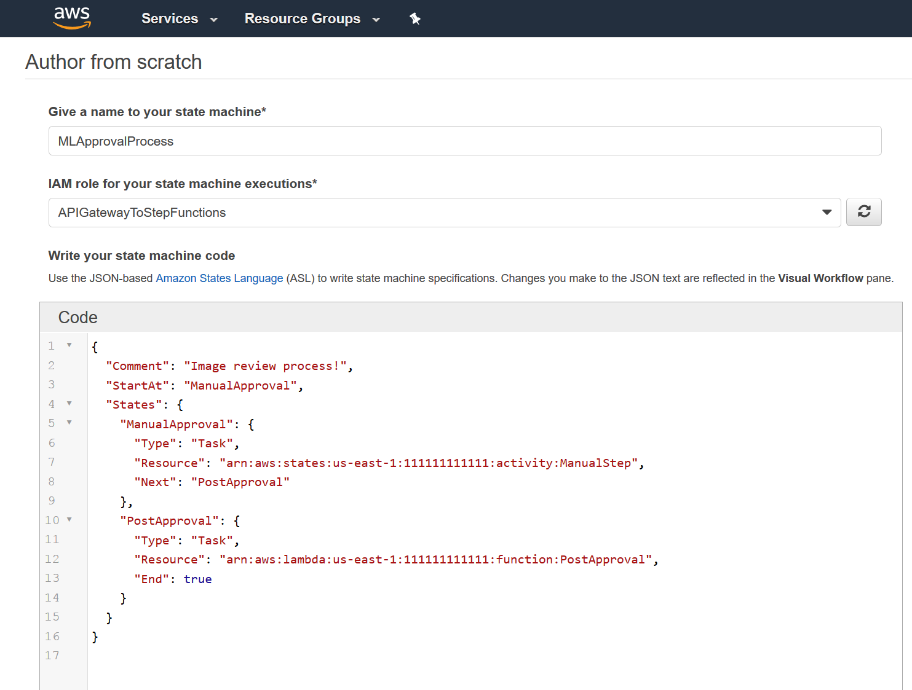

# Lab 5 - Approval Workflow (Step Functions and API GW)

## 1. Configure Step Functions

_We will use the AWS Step Functions service to define and control our overall workflow.  (For more information: https://aws.amazon.com/step-functions)_

1.	In the AWS Console, click on “Services” in the top, left-hand corner of the screen, and click on “Step Functions” (you can find it by typing _step_ into the search field at the top of the screen).
2.	Click "Get Started", and then click "Author from scratch".
3.	For the name, type _MLApprovalProcess_ (see screenshot below).
4.	For the IAM Role, ensure that the APIGatewayToStepFunctions role is selected.
5.	In the "Code" section, paste the following code and **replace the strings 111111111111 with your own AWS account Number**:
```{
  "Comment": "Image review process!",
  "StartAt": "ManualApproval",
  "States": {
    "ManualApproval": {
      "Type": "Task",
      "Resource": "arn:aws:states:us-east-1:111111111111:activity:ManualStep",
      "Next": "PostApproval"
    },
    "PostApproval": {
      "Type": "Task",
      "Resource": "arn:aws:lambda:us-east-1:111111111111:function:PostApproval",
      "End": true
    }
  }
}
```



6.	Click "Create State Machine" (at the bottom of the page).
7.	On the left-hand side of the screen, click "Tasks", then click "Create new activity".
8.	Type ManualStep in the "Activity Name" textbox, and then click "Create Activity".


## 2. Test Step Functions

1.	While still in the step functions console, on the left-hand side of the screen, click “Dashboard” (see screenshot below).


2.	Click directly on the state machine you just created (not on the radio button next to it) and then click “New execution”.
3.	Enter a name for the execution test and then click “Start execution” (see screenshot below).


4.	This will simply go into the ManualApproval activity for now:


5.	Now click “Stop execution” in the top, right-hand corner of the screen (see screenshot above).

## 3. Configure API Gateway

1.	Save the following Swagger file to your computer: [API Gateway Swagger File](./APIGatewayToStepFunctions-respond-swagger-apigateway.yaml), open the file for editing, and substitute all instances of the string **111111111111** with your own AWS account number.
2.	In the AWS Console, click on “Services” in the top, left-hand corner of the screen, and click on “API Gateway” (you can find it by typing api into the search field at the top of the screen).
3.	Click "Get Started", and then click "OK".
4.	Select the "Import from Swagger" option (see screenshot below).


5.	Click “Select Swagger File” and upload the swagger file you created in step 1 above.
6.	Click "Import" (in the bottom, right-hand corner of the screen).
7.	In the "Resources" section for your API, click the "Actions" drop-down menu and select "Deploy API". Enter the following details:
o	 Deployment stage: [New Stage]
o	Stage name: respond
8.	Click "Deploy".
9.	Note the "Invoke URL" that gets created for this API.  Copy this to a text file because you will need it in a later step (see example screenshot below).


10.	Paste the invoke URL into a browser tab to ensure that the API is responding. For now it will just return an error saying “{"message":"Missing Authentication Token"}”, which is expected at this point, because the request has not gone through the expected end-to-end workflow.


## 4. Update the Face Approval Page With the Invoke URL of API Gateway

1.	Edit the index.html file that you had saved on your computer in Lab 4, and replace the string **https://1o1bhkc8r9.execute-api.us-east-1.amazonaws.com/respond** with the invoke URL you noted in step 9 of section 3 above.
2.	In the AWS Console, click on “Services” in the top, left-hand corner of the screen, and click on “S3” (you can find it by typing _s3_ into the search field at the top of the screen).
3.	Click on the bucket you created for your static website (i.e. [Your name or username]-web), and then click “Upload”.
4.	Either drag and drop your index.html file into that space, or click “Add files” to browse for the file on your computer (see screenshot below).
5.	Click “Upload”.
6.	Now, in that bucket in S3, click on the file that you just uploaded, and then click “Make Public” (see screenshots below).


7.	Ensure that you can access your website via your browser by clicking on the link that is displayed at the bottom of the screen for that file (see screenshot above for reference).
8.	You should see a web-page like this:


_**Lab 5 Complete! [Next: Lab 6 - Bringing it All Together](../Lab6%20-%20Bringing%20it%20All%20Together/Lab6%20-%20Bringing%20it%20All%20Together.md)**_
